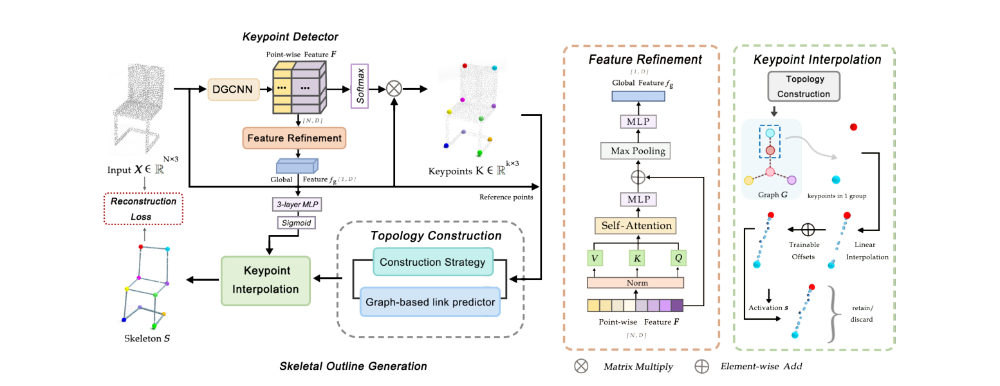
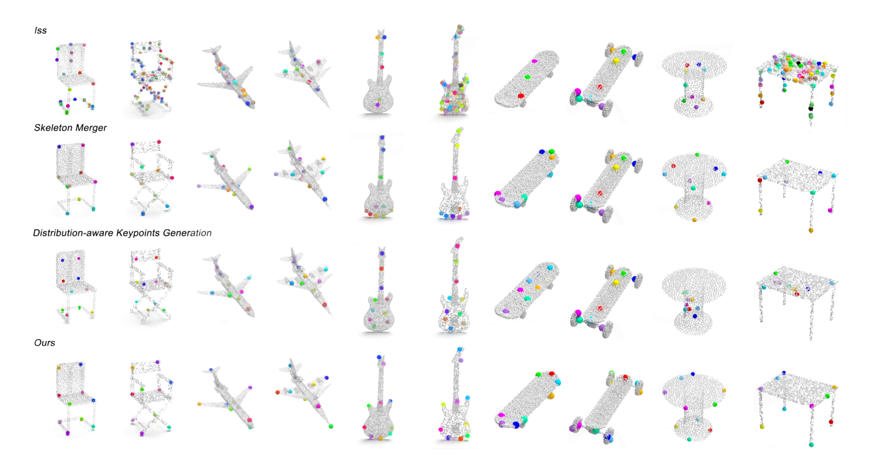

# SKNet: Skeleton Cues-based 3D Keypoint Detection

**Unsupervised 3D keypoint detection with skeletal topology guidance.**

SKNet couples keypoint detection with skeletal reconstruction to identify salient points that reflect the structure of a 3D object. It combines graph-based link prediction and learnable keypoint interpolation, using the reconstructed skeleton to guide keypoint localization without manual keypoint annotations during training.

## Architecture

*SKNet architecture for joint keypoint detection and skeletal reconstruction.*

- **Keypoint detection:** A DGCNN encoder extracts point features, while saliency weights determine keypoint locations. Transformer-based feature refinement provides global shape context.
- **Topology construction:** A geometric construction strategy and a graph-based link predictor establish connections between keypoints.
- **Skeletal reconstruction:** Learnable interpolation offsets and connection refinement produce skeletal outlines. Composite Chamfer Distance and offset regularization guide alignment with the input point cloud.

## Results

*Qualitative comparison of 3D keypoint detection across object categories. The bottom row shows SKNet predictions.*

Evaluation covers keypoint localization on **KeypointNet**, semantic consistency on **ShapeNet**, and generalization to real-world scans on **ScanObjectNN**.

KeypointNet mIoU scores at a distance threshold of 0.1. Higher is better.

| Category | Skeleton Merger | SKNet |
| --- | ---: | ---: |
| Airplane | 76.1 | **82.5** |
| Chair | 63.8 | **64.4** |
| Car | 47.8 | **58.8** |
| Guitar | 56.9 | **68.2** |
| Skateboard | 40.1 | **85.5** |
| Table | **58.6** | 56.1 |

SKNet achieves higher mIoU on five of the six reported categories, including gains of **11.0 points on cars** and **45.4 points on skateboards**.

## Code Overview

| Location | Contents |
| --- | --- |
| [`Keypoints/train.py`](Keypoints/train.py) | Model training script |
| [`Keypoints/eval_keypointnet.py`](Keypoints/eval_keypointnet.py) | Keypoint evaluation script |
| [`Keypoints/merger/`](Keypoints/merger/) | Network, loss, and point-cloud processing modules |
| [`Keypoints/requirements.txt`](Keypoints/requirements.txt) | Dependency list |

## Acknowledgments

The code builds on [Skeleton Merger](https://github.com/eliphatfs/SkeletonMerger) and includes components from [PointNet and PointNet++](https://github.com/yanx27/Pointnet_Pointnet2_pytorch). Please retain the original copyright notices and licenses, including [`Keypoints/LICENSE`](Keypoints/LICENSE).
